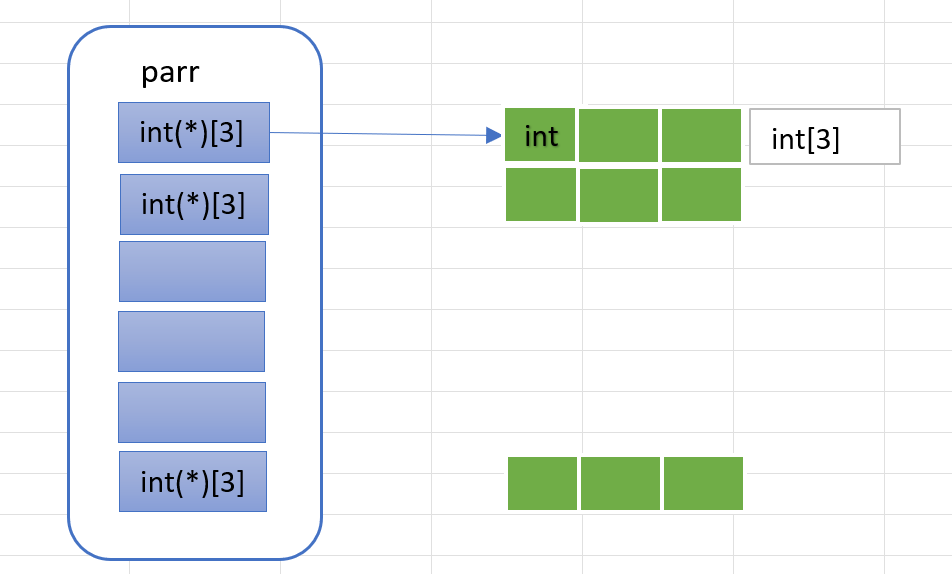

## 字符指针
```C
char* p = "abcdef";
```
```C
char arr1[] = "abc";
char arr2[] = "abc";
char* p1 = "abc";
char* p2 = "abc"; // 这两个是常量字符串

// ==
printf("%s\n", arr1 == arr2 ? "arr1 == arr2" : "arr1 != arr2");
// !=
printf("%s\n", p1 == p2 ? "p1 == p2" : "p1 != p2");
```

## 数组指针 & 指针数组
```C
int arr[5] = {1, 2, 3, 4, 5};
// []的优先级比*高，所以p有10个，类型是int*，是指针数组
int* p1[10] = &arr;  // error: invalid initializer

// 加了括号，*p代表p是一个指针(不是解引用)，指向的类型是int[10]，是数组指针
int(*p2)[5] = &arr;
```

### 二维数组的数组名的含义：
1. 首先把二维数组想象成一维数组 int (arr[3])[4]
2. 这个一维数组的每个元素是int[4]类型
3. 所以数组名代表的是 第一个int[4] 的地址，一个一维数组的地址

### 理解
```C
int (*parr[6])[3];
/*
parr[6] -> int(*)[3]
parr是数组，该数组有6个元素，每个元素是一个数组指针
每个数组指针指向的数组有3个元素，每个元素是int
*/
```


## 传参
### 一维数组
```C
// 都对
void test(int* arr);
void test(int arr[]);
void test(int arr[10]);
```
### 二维数组
```C
void test(int arr[3][5]);  // √
void test(int arr[][5]);  // √ 行可以省略
void test(int *arr); // × 二维数组的首元素是第一个数组的地址

// test((int**)arr)可以调用
// test(arr)不能调用，传过去的是一个一维数组的地址，不能放在一个指针里
void test(int **arr); 
void test(int (*arr) [5]);
```

### 二级指针
```C
void test(int** p){}
int main() {
    int a;
    int* pa = &a;
    test(&pa); // √
    int* arr[10];
    test(arr); // √
}
```

## 函数指针
指向函数的指针，函数名或者&函数名的地址相同
```C
int (*pa)(int, int) = add;
// 都能得出结果
printf("%d\n", pa(2, 3));
printf("%d\n", (*pa)(2, 3));
printf("%d\n", (**pa)(2, 3));
printf("%d\n", (***pa)(2, 3));
```

```C
/*
void (*)() 函数指针，无返无参
( void (*)() ) 0 强制类型转换，把0转换成函数指针，也就是说，地址0变成了一个函数的地址
最后去调用地址为0的函数
*/
(*(void (*)())0)();

/*
理解方式：void(*)(int)  signal( int, void(*)(int) )
signal是一个函数声明(注意不是指针)，返回值是函数指针
*/
void (*signal(int, void(*)(int)))(int);

// 简化上一行代码
typedef void(*pfun_t)(int); // 需要这样写，不能写成 void(*)int pfun_t
pfun_t signal(int, pfun_t);
```

### 函数指针数组
```C
int (*pf_arr[4])(int, int) = {add, sub, mul, div};
```
### 指向函数指针数组的指针
```C
/*
(*ppf_arr)[4] -> int(*)(int, int)
*/
int (*(*ppf_arr)[4])(int, int);
```

## 回调函数
通过函数指针调用的函数

## void\*
- 可以存放任何类型的数据
- 不能进行解引用操作
- 不能+-操作